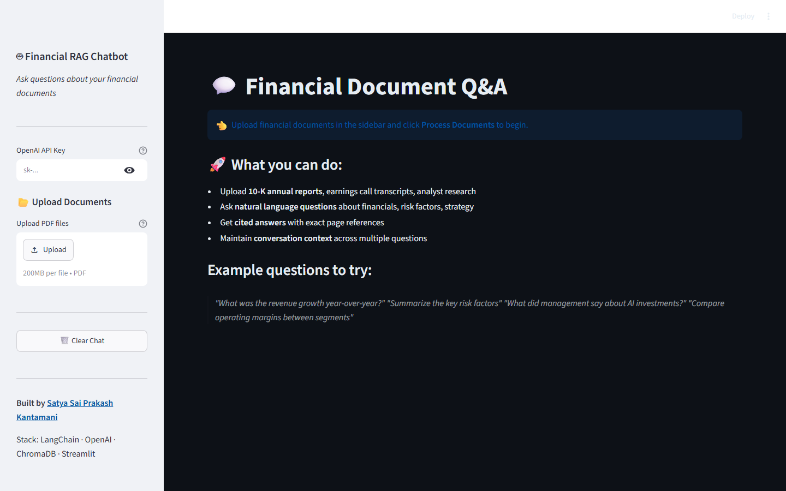

# Financial RAG Chatbot

> A Retrieval-Augmented Generation (RAG) chatbot for financial document analysis — powered by LangChain, OpenAI GPT-4, ChromaDB, and Streamlit.

[](https://huggingface.co/spaces/Prakashkantamani/financial-rag-chatbot)
[](https://github.com/Kantamaniprakash/financial-rag-chatbot/actions/workflows/ci.yml)
[](LICENSE)


**[▶ Try the live demo](https://huggingface.co/spaces/Prakashkantamani/financial-rag-chatbot)** — upload a financial PDF and ask questions. Bring your own OpenAI API key (entered in the sidebar, used only for your session, never stored).

---


*The app on first launch: enter an OpenAI API key in the sidebar, upload financial PDFs, and start asking questions.*

## Overview

Financial documents (10-Ks, earnings call transcripts, analyst reports) are dense and time-consuming to parse. This app lets you **upload any PDF and ask questions in natural language** — getting precise, source-cited answers in seconds.

### Key Features
- **Multi-document ingestion** — upload multiple PDFs simultaneously
- **Semantic vector search** — ChromaDB indexes document chunks with MMR retrieval for diverse, relevant results
- **Conversational memory** — maintains context across multiple questions (sliding window of last 5 turns)
- **Source citations** — every answer shows which document and page it came from
- **Financial-domain system prompt** — tuned for precise financial data extraction (numbers, dates, ratios)
- **Dark-themed UI** — clean chat interface with styled message bubbles and source chips

---

## Architecture

```
User Query
    │
    ▼
Query Embedding (OpenAI text-embedding-3-small)
    │
    ▼
ChromaDB Vector Store ──▶ Top-5 Relevant Chunks (MMR, fetch_k=15)
    │
    ▼
LangChain ConversationalRetrievalChain
    │
    ▼
GPT-4o-mini (with retrieved context + conversation history)
    │
    ▼
Answer + Source Citations (file name + page number)
```

---

## Tech Stack

| Component        | Technology                               |
|-----------------|------------------------------------------|
| LLM             | OpenAI GPT-4o-mini (swappable to GPT-4)  |
| Embeddings      | OpenAI text-embedding-3-small            |
| Vector Store    | ChromaDB (persistent local storage)      |
| Retrieval       | MMR (Maximal Marginal Relevance)         |
| Orchestration   | LangChain ConversationalRetrievalChain   |
| PDF Parsing     | PyMuPDF (fitz) — reads from bytes for cross-platform compatibility |
| Text Splitting  | RecursiveCharacterTextSplitter (1000 chars, 200 overlap) |
| Memory          | ConversationBufferWindowMemory (k=5)     |
| UI              | Streamlit with custom dark theme CSS     |

---

## Getting Started

### 1. Clone the repository
```bash
git clone https://github.com/Kantamaniprakash/financial-rag-chatbot.git
cd financial-rag-chatbot
```

### 2. Install dependencies

With [uv](https://docs.astral.sh/uv/) (recommended — uses the committed lockfile):
```bash
uv sync
```

Or with pip:
```bash
pip install -r requirements.txt
```

### 3. Run the app
```bash
streamlit run app.py
```

### 4. Enter your OpenAI API key in the sidebar and upload documents

---

## Usage

1. Open `http://localhost:8501` in your browser
2. Enter your OpenAI API key in the sidebar
3. Upload one or more financial PDF documents
4. Click **"Process Documents"** — the app chunks, embeds, and indexes them in ChromaDB
5. Type your question in the chat input
6. Get answers with source citations (file name + page number)

### Example Questions
- *"What was Apple's revenue growth YoY in Q3?"*
- *"Summarize the key risk factors mentioned in this 10-K"*
- *"What did the CEO say about AI strategy in the earnings call?"*
- *"Compare the gross margins between the two uploaded reports"*
- *"What are the major capital expenditure items mentioned?"*

---

## Project Structure

```
financial-rag-chatbot/
├── app.py              # Main Streamlit app (UI + RAG pipeline + PDF loader)
├── eval_harness.py     # Retrieval + generation evaluation harness
├── tests/
│   └── test_smoke.py   # CI smoke tests (ast-parse sources, check key files)
├── docs/
│   └── screenshot.png  # UI screenshot embedded in this README
├── .streamlit/
│   └── config.toml     # Streamlit server config (XSRF/CORS enabled)
├── .github/
│   ├── workflows/ci.yml    # CI: uv-locked install, lint + tests on Python 3.10–3.12
│   └── dependabot.yml      # Weekly pip + GitHub Actions updates
├── .env.example        # Template for required environment variables
├── pyproject.toml      # Project metadata + dependencies (PEP 621)
├── uv.lock             # Locked dependency resolution (uv)
├── requirements.txt    # Pip-compatible dependency pins
├── LICENSE             # MIT
└── README.md
```

---

## How It Works

1. **PDF Ingestion** — PyMuPDF reads uploaded PDFs from bytes (no temp files needed), extracts text page-by-page with metadata (source file, page number)
2. **Chunking** — RecursiveCharacterTextSplitter breaks pages into overlapping 1000-character chunks for optimal retrieval granularity
3. **Embedding** — OpenAI `text-embedding-3-small` converts chunks into dense vectors
4. **Indexing** — ChromaDB stores vectors in a persistent local database for fast similarity search
5. **Retrieval** — MMR retrieval fetches top-5 most relevant and diverse chunks from a candidate pool of 15
6. **Generation** — GPT-4o-mini generates answers grounded in retrieved context, with a financial-domain system prompt enforcing citation and precision
7. **Memory** — Sliding window keeps last 5 conversation turns for multi-turn follow-up questions

---

## Results

**What is measured.** The repo ships an evaluation harness (`eval_harness.py`, see
[Evaluation](#evaluation)) that scores the retriever and the generator as separate components
against a committed fixture corpus (10 synthetic financial passages) and a labeled eval set
(10 questions with known-relevant chunks and expected facts):

| Component | Metric | Method |
|-----------|--------|--------|
| Retriever | Hit Rate@k | fraction of questions with a relevant chunk in the top-k |
| Retriever | MRR@k | mean reciprocal rank of the first relevant chunk |
| Generator | Faithfulness | LLM-judge pass/fail: is the answer grounded in retrieved context? |
| Generator | Answer relevancy | LLM-judge 1–5 score for how directly the answer addresses the question |
| Generator | Keyword coverage | sanity check that expected facts appear in the answer |

**What is not claimed.** No benchmark numbers are published in this repo: running the harness
requires an OpenAI API key, and its output (`eval_results.json`) is deliberately not committed
so stale numbers never drift out of sync with the code. Qualitative observations from
development — sub-second retrieval on ~50-page PDFs, ChromaDB comfortably indexing 100+ page
collections on a single laptop — are anecdotal, not benchmarked.

### Limitations

- **Synthetic eval corpus** — the harness's 10-passage fixture set is small and synthetic; scores on it do not guarantee performance on real 10-Ks or earnings transcripts.
- **LLM-judge subjectivity** — faithfulness and relevancy are scored by an LLM judge, which carries its own biases and run-to-run variance.
- **No hallucination guarantee** — the system prompt enforces grounding and citation, but LLM outputs can still contain unsupported statements; citations identify retrieved chunks, not independently verified facts.
- **API cost and dependency** — every indexed chunk and every question incurs OpenAI embedding/completion calls; there is no local-model fallback.
- **Single-machine scale, text PDFs only** — ChromaDB runs embedded with local persistence (no auth, no multi-user serving), and PyMuPDF extracts embedded text only, so scanned/image-based PDFs need OCR that is not included.

---

## Evaluation

`eval_harness.py` evaluates the retriever and the generator as separate
components, which is the current best practice for debugging RAG systems —
it tells you whether a bad answer came from the retriever surfacing the
wrong chunks or the LLM misusing good ones.

It ships with its own fixture corpus (10 synthetic financial passages) and
a labeled eval set (10 questions with known-relevant chunks and expected
facts), so it runs standalone against a fresh in-memory Chroma store —
no uploaded PDFs required.

**Retrieval metrics**
- **Hit Rate@k** — fraction of questions where a relevant chunk is in the top-k results
- **MRR@k** — mean reciprocal rank of the first relevant chunk

**Generation metrics**
- **Faithfulness** — LLM-judge pass/fail on whether the answer is grounded in the retrieved context
- **Answer relevancy** — LLM-judge 1-5 score for how directly the answer addresses the question
- **Keyword coverage** — sanity check that expected facts appear in the answer

```bash
export OPENAI_API_KEY=sk-...
python eval_harness.py            # k=5 by default
python eval_harness.py --k 3 --output results.json
```

This prints a summary report plus a per-question pass/fail breakdown, and
writes full results (including every generated answer and judge reasoning)
to `eval_results.json`.

## Future Improvements
- [ ] Add support for Excel/CSV financial data ingestion
- [ ] Implement reranking with Cohere Rerank API for improved precision
- [ ] Add financial-specific analysis templates (DCF, ratio analysis, peer comparison)
- [ ] Support for EDGAR API direct 10-K/10-Q downloads
- [ ] Deploy to Streamlit Cloud or AWS EC2

---

## Author

**Satya Sai Prakash Kantamani** — Data Scientist
[Portfolio](https://kantamaniprakash.github.io) · [GitHub](https://github.com/kantamaniprakash) · [LinkedIn](https://www.linkedin.com/in/prakash-kantamani) · [Email](mailto:prakashkantamani90@gmail.com)
